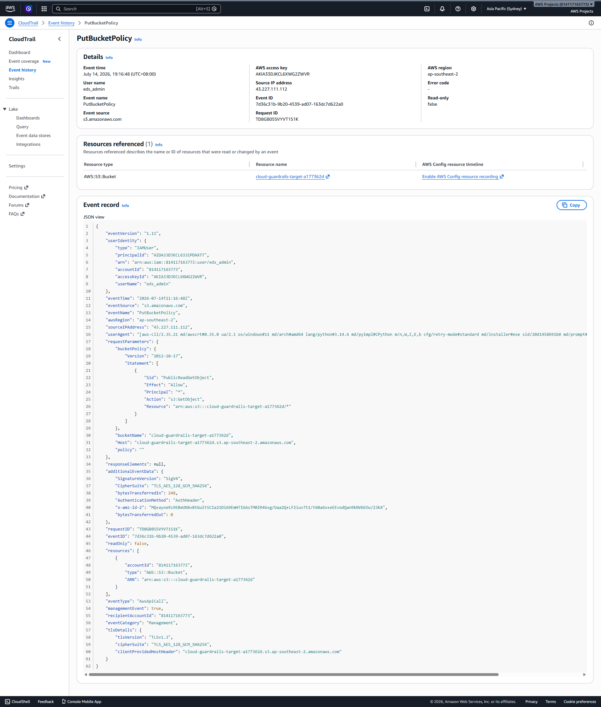
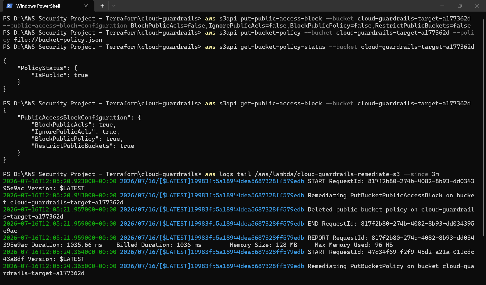
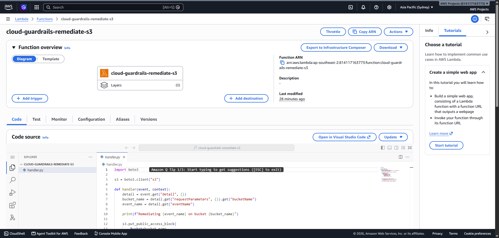

# Cloud Guardrails: Automated S3 Misconfiguration Detection and Remediation

Detects when an S3 bucket becomes public and fixes it automatically, usually within 30-90 seconds, with no human involved.

Public S3 buckets are one of the most common causes of real cloud data breaches, usually from a misconfiguration rather than a sophisticated attack. This project builds a small, working version of the detect-and-remediate mechanism that CSPM tools (Wiz, Security Hub, Prisma Cloud) use in production.

## What it does

1. An S3 bucket is made public (simulating a misconfiguration or an attacker's action)
2. CloudTrail logs the exact API call, including who made it and when
3. EventBridge matches on that specific event type
4. A Lambda function reverts the bucket to private automatically
5. The system ignores its own remediation actions, so it doesn't trigger itself in a loop

## Architecture

```
Public bucket policy applied
        |
        v
CloudTrail (records the change, with full identity attribution)
        |
        v
EventBridge rule (matches PutBucketPolicy / PutBucketAcl / PutBucketPublicAccessBlock,
                   excludes events caused by the remediation Lambda's own role)
        |
        v
Lambda function (removes public policy, re-enables public access block)
        |
        v
Bucket is private again, typically within 30-90 seconds
```

## Seeing it in action

**The attack, recorded automatically.** A public bucket policy is attached, and CloudTrail captures the exact policy, the identity that applied it, and the timestamp.



**Automated remediation firing correctly.** With the full pipeline wired up, breaking the bucket triggers a fix within seconds, and the fix does not re-trigger itself.



**The actual deployed function.** Not a snippet, the real code running in AWS.



More screenshots covering each build stage are in `screenshots/`.

## Tools used

- **Terraform** for infrastructure as code (S3, CloudTrail, EventBridge, IAM)
- **AWS Lambda (Python 3.12)** for the remediation logic
- **AWS CLI** for manual testing and verification at every stage
- **boto3** for the AWS calls inside the Lambda function

## How this was built, honestly

This was my first hands-on cloud security project. I have limited prior AWS and Python experience, and I used AI assistance to help write the Terraform and Python code. What I did myself: understood every resource and every line before applying it, tested each component in isolation before connecting it, and diagnosed and fixed two real bugs during the build (below). The point of this project wasn't writing code from scratch. It was understanding exactly how detection and automated response work in a cloud environment, well enough to explain and defend every decision.

## Two real problems I hit and fixed

**Silent EventBridge delivery failure.** The EventBridge rule matched correctly, but nothing arrived at its CloudWatch Logs target, with no error anywhere. Cause: EventBridge targets writing to CloudWatch Logs need an explicit resource policy granting `events.amazonaws.com` permission on that specific log group. Matching a rule and having permission to deliver to the target are two separate things, and AWS doesn't fail loudly when the second one is missing. Adding the log resource policy fixed it.

**Remediation feedback loop.** Once wired up and tested against a real misconfiguration, the Lambda worked, but fired every few seconds instead of once. Cause: the Lambda's own remediation actions are themselves API calls, which CloudTrail logs, which match the same EventBridge rule that triggers the Lambda. It was reacting to its own fixes. Fixed by adding an identity filter to the EventBridge rule, excluding any event where CloudTrail's `userIdentity.arn` matches the Lambda's own IAM role.

## IAM design

The Lambda's execution role is scoped to exactly three S3 actions (`PutBucketPublicAccessBlock`, `GetBucketPolicy`, `DeleteBucketPolicy`) on resources matching this project's naming prefix, plus the minimum CloudWatch Logs permissions needed to write its own execution logs. No broad S3 access, no access to any other bucket in the account.

## What I'd add next

- AWS Config rules alongside the EventBridge path, to compare continuous compliance checking against this event-driven approach
- SNS notification on every remediation action
- A second detection and remediation path for an open SSH security group, using GuardDuty findings
- Multi-account support using cross-account EventBridge

## Repository contents

- `terraform/` – all infrastructure definitions
- `lambda/remediate_s3/handler.py` – the remediation function
- `lambda/remediate_s3/test_local.py` – local test script used before deploying to AWS
- `screenshots/` – CloudTrail events, EventBridge configuration, and Lambda execution logs from an actual run
